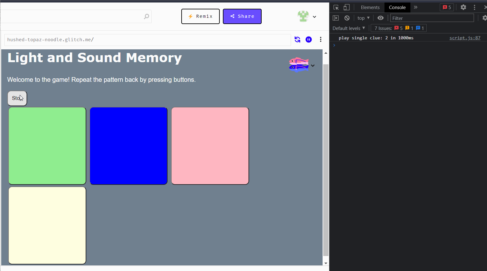

# Pre-work - *Memory Game*

**Memory Game** is a Light & Sound Memory game to apply for CodePath's SITE Program. 

Submitted by: **Viet Dinh**

Time spent: **1.5** hours spent in total

Link to project: https://glitch.com/edit/#!/hushed-topaz-noodle?path=script.js%3A1%3A0

## Required Functionality

The following **required** functionality is complete:

* [x] Game interface has a heading (h1 tag), a line of body text (p tag), and four buttons that match the demo app
* [x] "Start" button toggles between "Start" and "Stop" when clicked. 
* [x] Game buttons each light up and play a sound when clicked. 
* [x] Computer plays back sequence of clues including sound and visual cue for each button
* [x] Play progresses to the next turn (the user gets the next step in the pattern) after a correct guess. 
* [x] User wins the game after guessing a complete pattern
* [x] User loses the game after an incorrect guess

The following **optional** features are implemented:

* [ ] Any HTML page elements (including game buttons) has been styled differently than in the tutorial
* [ ] Buttons use a pitch (frequency) other than the ones in the tutorial
* [ ] More than 4 functional game buttons
* [ ] Playback speeds up on each turn
* [ ] Computer picks a different pattern each time the game is played
* [ ] Player only loses after 3 mistakes (instead of on the first mistake)
* [ ] Game button appearance change goes beyond color (e.g. add an image)
* [ ] Game button sound is more complex than a single tone (e.g. an audio file, a chord, a sequence of multiple tones)
* [ ] User has a limited amount of time to enter their guess on each turn

The following **additional** features are implemented:

- [ ] List anything else that you can get done to improve the app!

## Video Walkthrough (GIF)

If you recorded multiple GIFs for all the implemented features, you can add them here:

## Reflection Questions
1. If you used any outside resources to help complete your submission (websites, books, people, etc) list them here. 
https://developer.mozilla.org/en-US/docs/Web/API/AudioContext
https://developer.mozilla.org/en-US/docs/Web/API/GainNode
https://developer.mozilla.org/en-US/docs/Web/API/OscillatorNode
https://developer.mozilla.org/en-US/docs/Web/API/AudioParam/setTargetAtTime

2. What was a challenge you encountered in creating this submission (be specific)? How did you overcome it? (recommended 200 - 400 words) 

    A challenge that I came across in creating the Light and Memory game is understanding what certain functions did, specifically the ones that controlled playing the tones, playTone(), startTone(), and stopTone(). From reading the prework’s description, I understood that playTone() played the corresponding tone for a given button for a given period of time, and that startTone() and stopTone() were self explanatory, however I wanted to know how these functions used the AudioContext library to generate sounds for the buttons. I knew that the best way to learn about a library was to read its documentation, and so I headed over to Mozilla’s web API site to learn more. I focused on what the AudioContext itself was, and that turned out to be an audio processing graph made from different connected audio nodes , including a gain node and an oscillator node that I noticed was initialized and then used in the tone playing functions. I then looked at how each function used parts of the AudioContext library to perform its function. At the core of each function was this snippet of code:  
o.frequency.value = freqMap[btn]; 
g.gain.setTargetAtTime(volume,context.currentTime + 0.05,0.025; 
    For both lines of code, I dissected parts of the code and read about what it was or what it did in the documentation. 
The first line assigns the oscillator’s frequency value to the given button’s corresponding frequency in the frequency map we created, freqMap. Taking apart this, I learned first that the oscillator itself represents a periodic waveform, and is functionally responsible for creating the tone in this program. The frequency value of o, the oscillator, accepts a number that represents the hertz of a frequency that you want to hear. By learning this part of how the oscillator worked, it made sense to me that a lower number would produce a deep sound, and a high number a high pitched sound - this controlled the pitch of the sound we were hearing. I did the same for the next line where I learned that the gain controlled the volume of the sound we were hearing, and through setTargetAtTime(), took in the target volume, the time to start changing the volume, and then a constant to control how fast the volume change would be.  
    Reading the documentation always helps me understand the code I used better, and thus gives me free reign to manipulate it however I want. I find that knowing how the libraries I use work gives me control over the functionality of my program, including expanding its properties, modifying it, and understanding why things sometimes go wrong. Exercising this allowed me to resolve my confusion of how the AudioContext library was used to produce sound in the prework. 

3. What questions about web development do you have after completing your submission? (recommended 100 - 300 words)  
I’ve taken a cybersecurity course in the past and I’ve learned how cookies and many other things in a website can be exploited to retrieve information that’s supposed to be inaccessible. So I'm interested in how cookies are used, as well as how professionals in the field approach security problems and how they design their user interaction to be able to keep whatever data they have secure. Questions like how you authenticate users and make sure that whoever is logging in to an account truly is the person that owns it come to mind and interest me. Something that comes to my mind a lot is how web dev professionals approach the design of a website. How is data shared with the user and how does a website even connect to the internet and is reached by people around the world? There’s a lot I don’t know about web development that leads into me mainly being curious into how things work. 

4. If you had a few more hours to work on this project, what would you spend them doing (for example: refactoring certain functions, adding additional features, etc). Be specific. (recommended 100 - 300 words)  
This game reminds me a lot of the Human Benchmark website that has games that measure your cognitive abilities, so I’d like to add features that go in the spirit of that which test the limits of your brain. First I’d make the pattern random so I could make the pattern variable in length. I’d also create a “blackout” feature that hides all the other buttons and only shows the button being shown to test if relational data is used by the mind to remember the pattern. Going along with that idea, removing the visual indicators for playing the pattern sequence and relaying a text on the screen that displays the button colors in order would be interesting too. I’d also just make the test sound based, removing the color and the highlighting of the button, so players would hear a sound sequence and press the buttons to play the sound in order. Something like a leaderboard would be really cool too to see how you match up with other players that played the game. If I were to invest a lot of time into it, my ideas would go along the lines of the ones I just mentioned where I add different modes that add to the Light and Memory game that tests the abilities of the human brain. 

## Interview Recording URL Link

## License

    Copyright [Viet Dinh]

    Licensed under the Apache License, Version 2.0 (the "License");
    you may not use this file except in compliance with the License.
    You may obtain a copy of the License at

        http://www.apache.org/licenses/LICENSE-2.0

    Unless required by applicable law or agreed to in writing, software
    distributed under the License is distributed on an "AS IS" BASIS,
    WITHOUT WARRANTIES OR CONDITIONS OF ANY KIND, either express or implied.
    See the License for the specific language governing permissions and
    limitations under the License.
